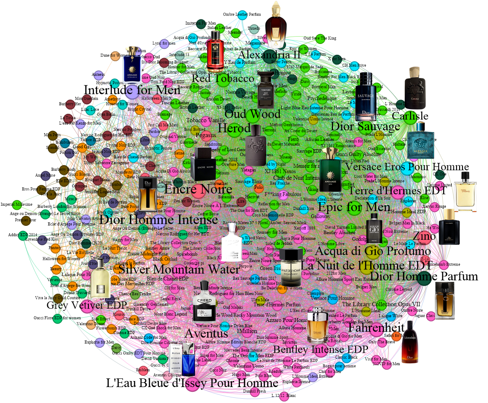

# Sentiment Driven Community Detection in a Network of Perfume Preferences

<p align="center">
  
</p>

## 📖 Overview
This repository contains datasets used in our paper, [**"Sentiment-Driven Community Detection in a Network of Perfume Preferences."**](https://arxiv.org/abs/2410.19177) The research focuses on applying community detection techniques to analyze a network of perfume preferences based on positive user reviews from a Persian retail platform, Atrafshan. The study leverages sentiment analysis to group perfumes into clusters, revealing shared consumer preferences in the fragrance domain.

### ✨ Key Contributions

- **🔍 Novel Community Detection**: First application of community detection methods to perfume networks, enhancing insights into consumer preferences in the fragrance industry.

- **📊 Rich Dataset**: Extraction and availability of a comprehensive dataset from a Persian perfume retail platform, including user reviews and ratings, hosted on GitHub for further analysis.

- **😊 Enhanced Sentiment Analysis**: Innovative incorporation of emojis and user ratings, refining sentiment classification and capturing emotional context in reviews.

- **⚖️ Refined Edge Weights**: Integration of user ratings to adjust edge weights in the Perfume Co-Preference Networks, ensuring a nuanced representation of consumer preferences.

- **📈 Increased Modularity**: Improvements in modularity scores through sentiment-based network construction, leading to clearer groupings of similar perfumes based on shared user preferences.


### 🏷️ Keywords:
Community Detection, Data Mining, Perfume Networks, Sentiment Analysis, User Preferences, Co-Preference Network, Persian Retail Platform.

## 📂 Datasets
This repository includes multiple datasets used for the study, providing a comprehensive view of perfume reviews, sentiment analysis, and emoji mappings.

## 1. **User Reviews and Perfume Attributes Dataset**
- **Comments:** 36,434 comments from 7,387 unique users.
- **Ratings:** User ratings on perfume attributes such as Scent, Longevity, Sillage, and Bottle Design.
- **Metadata:** Includes usernames, user IDs, and comment types (e.g., standalone or replies).

#### Fields:
- **user_id:** Unique identifier for the user.
- **user_name:** Name of the user who left the comment.
- **comment_text:** The text of the user's review, providing insights into their sentiment towards the perfume.
- **perfume_id:** Unique identifier for the perfume.
- **perfume_name:** Name of the perfume.
- **perfume_brand:** Brand of the perfume.
- **perfume_url:** URL to the perfume's page on the Atrafshan website.
- **scent_specifications:** Fragrance group, perfumer, and nature of the perfume (e.g., warm, fresh).
- **production_specifications:** Brand name (in Farsi), country of origin, and release year of the perfume.
- **users_vote:** Community-wide ratings on various perfume attributes (scent, longevity, diffusion, and design).
- **user_vote_on_perfume:** Specific user ratings on perfume aspects.

#### Example JSON Structure:
```json
{
    "user_id": "93040",
    "user_name": "علی",
    "comment_text": "در برنامه خریدم هست ولی نمیدونم چرا نمیتونم باهاش کنار بیام حس میکنم بوی رژ لب میده",
    "perfume_id": "1030",
    "perfume_name": "Dior Homme Intense",
    "perfume_brand": "Dior",
    "perfume_url": "https://www.atrafshan.ir//perfume/1030-480/dior-homme-intense",
    "scent_specifications": {
        "fragrance_group": "چوبی گلی مُشکی",
        "perfumer": "فرانسوا دماشی",
        "nature": "گرم"
    },
    "production_specifications": {
        "brand_name_farsi": "دیور",
        "origin_country": "فرانسه",
        "release_year": "2007"
    },
    "users_vote": {
        "smell": "8.2",
        "durability": "7.8",
        "diffusion": "7.6",
        "design": "8.2"
    },
    "user_vote_on_perfume": {
        "votes": {
            "رایحه": "8",
            "ماندگاری": "7",
            "پخش بو": "7",
            "طراحی شیشه": "8"
        },
        "comment_id": "128773",
        "is_comment_answer": "NO"
    }
}
```
## 2. Emoji Mapping Dataset
A dictionary of **392 common emojis** mapped to their Persian equivalents.

#### Example:

```
- "😍" → "چشم های عاشق" ("Loving Eyes").
```

This dataset allows for a more accurate sentiment analysis by incorporating emoji usage in user comments.

## 3. Sentiment Classification Results
We provide **three CSV files** containing the sentiment classification results, with each file biased towards a specific perfume attribute: **Scent**, **Longevity**, or **Sillage**.

### Methodology:
First, we used the [**ParsBert**](https://github.com/hooshvare/parsbert) model to classify comments based on sentiment. The sentiment classification was conducted on the user comments, where only positive comments were considered for constructing the perfume-perfume network.

To further enhance the accuracy of sentiment classification, we integrated **user votes** on three essential perfume categories—**Scent**, **Longevity**, and **Sillage**—into the sentiment analysis process. This integration provided a more refined sentiment classification for each aspect of the perfume experience.

### Sentiment Classification Integration:
To enhance the accuracy of sentiment labels, user votes regarding three essential perfume attributes—**Scent**, **Longevity**, and **Sillage**—were integrated into the classification process. Each user's rating (R) for these categories was used to bias the sentiment analysis, as detailed below:

- **R ≥ 7:** Positive sentiment.
- **R ≤ 3:** Negative sentiment.
- **4 < R < 7:** Ambiguous, no sentiment change.

This systematic integration allows for a more nuanced understanding of consumer preferences across different dimensions of the perfume experience.

### CSV Files:
1. **Scent-biased sentiment classification**
2. **Longevity-biased sentiment classification**
3. **Sillage-biased sentiment classification**

## 🚀 Usage
The datasets provided in this repository are available for use in further research and analysis. They can be leveraged to study user preferences, conduct community detection, or enhance recommendation systems in the fragrance industry.

### Potential Use Cases of the Dataset

The **Sentiment-Driven Community Detection in a Network of Perfume Preferences** dataset has diverse applications across fields like recommendation systems, consumer insights, and network analysis. Below are some key use cases:

#### 1. Personalized Recommendation Systems
Using the perfume co-preference network, businesses can create recommendation systems that align closely with users' tastes. By analyzing user reviews and ratings, perfumes can be recommended based on positively weighted preferences, refining personalization and boosting user satisfaction.

#### 2. Market Segmentation
The dataset facilitates the identification of perfume clusters based on shared user preferences, creating distinct market segments within the fragrance industry. Marketers and retailers can leverage these segments to tailor campaigns and promotions, enhancing relevance for each group and increasing engagement and sales.

#### 3. Sentiment Analysis in Niche Markets
With rich sentiment data—including emoji usage and nuanced ratings—this dataset is valuable for conducting sentiment analysis tailored to the fragrance industry. Researchers can use it to explore fragrance trends, consumer satisfaction, and the cultural factors influencing perfume choices, particularly in Persian-speaking regions.

#### 4. Enhancing User Experience through Community Detection
Community detection techniques can reveal how user preferences cluster and evolve over time. This insight can be applied to improve online retail interfaces, where users are shown suggestions from familiar or popular preference communities, enhancing user experience and assisting decision-making.

#### 5. Insights for Product Development
Fragrance companies can use this dataset to understand popular scent profiles, longevity, and sillage attributes, guiding product design and development. By focusing on fragrance features that resonate with consumers, companies can improve the success of new product launches.

#### 6. Academic Research and Data Mining
The dataset serves as an excellent resource for researchers and data scientists in fields like sentiment-driven network analysis, community detection, and co-preference networks. It provides a practical case study for applying these methodologies to consumer data, enriching studies in consumer behavior, data mining, and sentiment analysis.

#### 7. Evaluating the Influence of External Factors
Researchers can investigate how seasonal trends, marketing campaigns, and cultural events influence fragrance preferences. These insights can support demand forecasting and strategy alignment with external factors impacting consumer choices.


## 📜 Terms of Use
The datasets are shared for academic and non-commercial purposes only. Please ensure proper citation if you use the data in your work.

## 📖 Citation
If you use the datasets or findings from our paper, please cite [our paper](https://arxiv.org/abs/2410.19177) in your work:

```bibtex
@ARTICLE{2024arXiv241019177K,
       author = {{Kalashi}, Kamand and {Saed}, Sajjad and {Teimourpour}, Babak},
        title = "{Sentiment-Driven Community Detection in a Network of Perfume Preferences}",
      journal = {arXiv e-prints},
     keywords = {Computer Science - Social and Information Networks, Computer Science - Information Retrieval, G.2.2, I.2.6, J.4},
         year = 2024,
        month = oct,
          eid = {arXiv:2410.19177},
        pages = {arXiv:2410.19177},
          doi = {10.48550/arXiv.2410.19177},
archivePrefix = {arXiv},
       eprint = {2410.19177},
 primaryClass = {cs.SI},
       adsurl = {https://ui.adsabs.harvard.edu/abs/2024arXiv241019177K},
      adsnote = {Provided by the SAO/NASA Astrophysics Data System}
}
```
## 📝 License

This project is licensed under the MIT License. See the [LICENSE](./LICENSE) file for more details.

If you use this repository, please mention the original GitHub repository by linking to [SentimentDrivenCommunityDetection](https://github.com/Kalashi-Saed-Collaborations/SentimentDrivenCommunityDetection/). This helps support the project and acknowledges the contributors.

## 👩‍💻 Authors
**Kamand Kalashi**  
 <p align="left">
  <a href="https://www.linkedin.com/in/kamand-kalashi-0696b1199/" target="_blank">
    
  </a>  
  <a href='https://scholar.google.com/citations?user=Rjiq7qUAAAAJ&hl=en' target="_blank">
    
  </a>
  <a href="https://www.researchgate.net/profile/Kamand-Kalashi" target="_blank">
    
  </a>
    <a href="mailto:kalashi.kamand@gmail.com" target="_blank">
    
  </a>
</p>
  
**Sajjad Saed**  
<p align="left">
  <a href="https://www.linkedin.com/in/sajjad-saed-845908125/" target="_blank">
    
  </a>  
  <a href='https://scholar.google.com/citations?user=4xT5JlQAAAAJ&hl=en' target="_blank">
    
  </a>
  <a href="https://www.researchgate.net/profile/Sajjad-Saed" target="_blank">
    
  </a>
    <a href="mailto:ssaed.89@gmail.com" target="_blank">
    
  </a>
</p>

**Dr.Babak Teimourpour**
<p align="left">
  <a href="https://www.linkedin.com/in/babak-teimourpour-7877482b/" target="_blank">
    
  </a>  
  <a href='https://scholar.google.com/citations?user=Hb0DMrUAAAAJ&hl=en' target="_blank">
    
  </a>
  <a href="https://www.researchgate.net/profile/Babak-Teimourpour" target="_blank">
    
  </a>
</p>

##
<div align="left">
  
</div>
